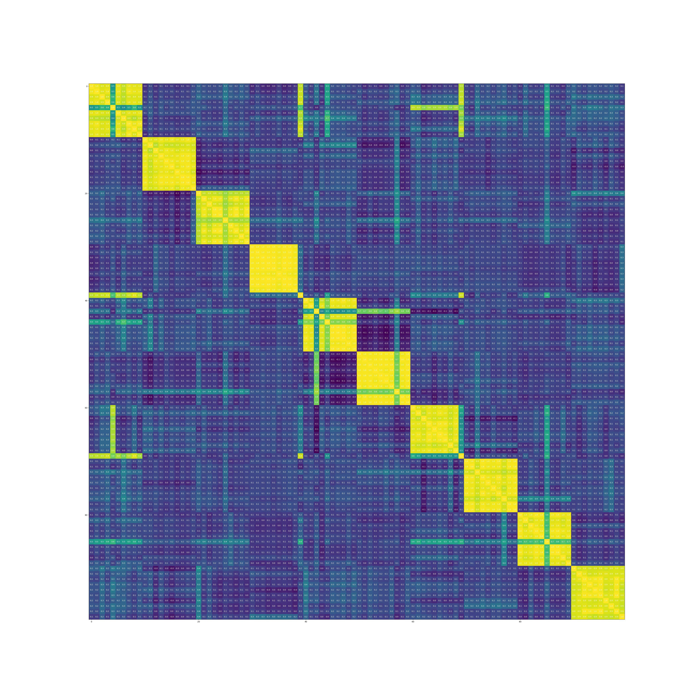
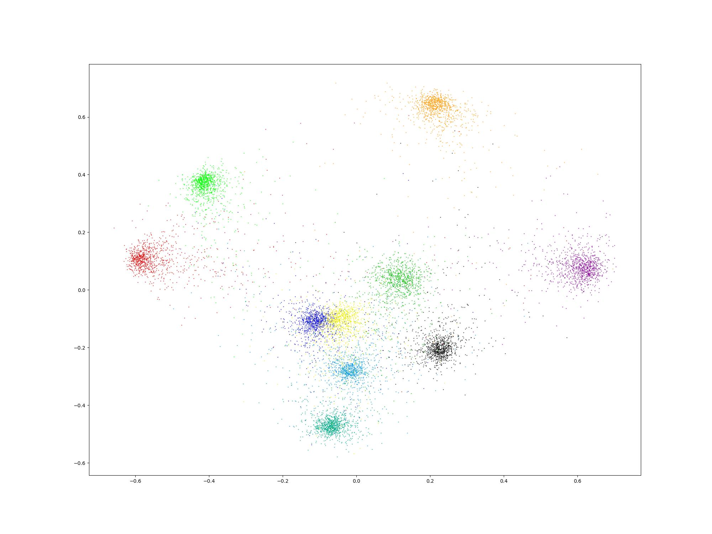
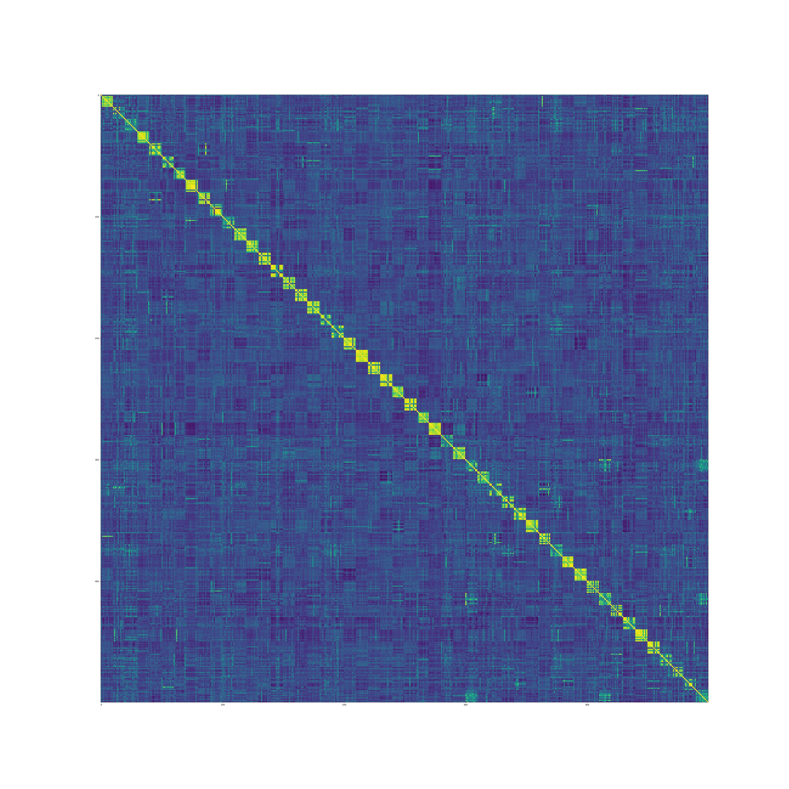
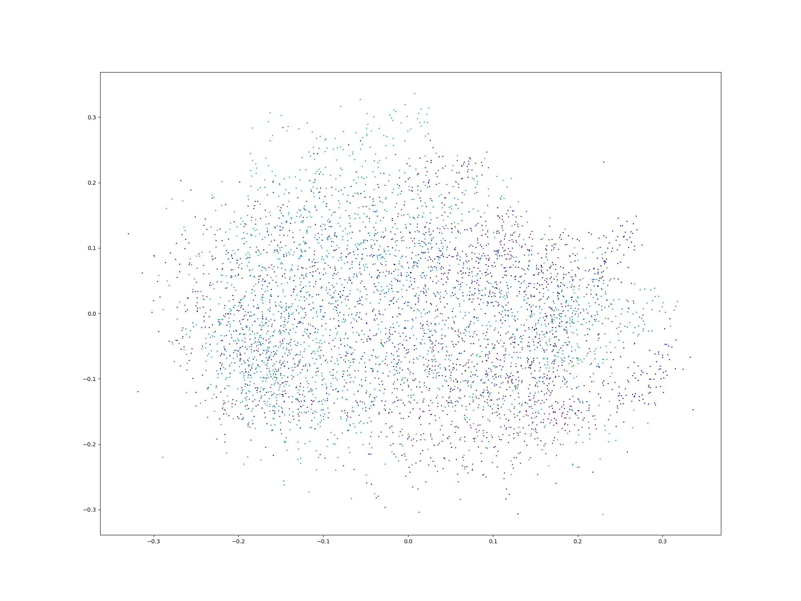
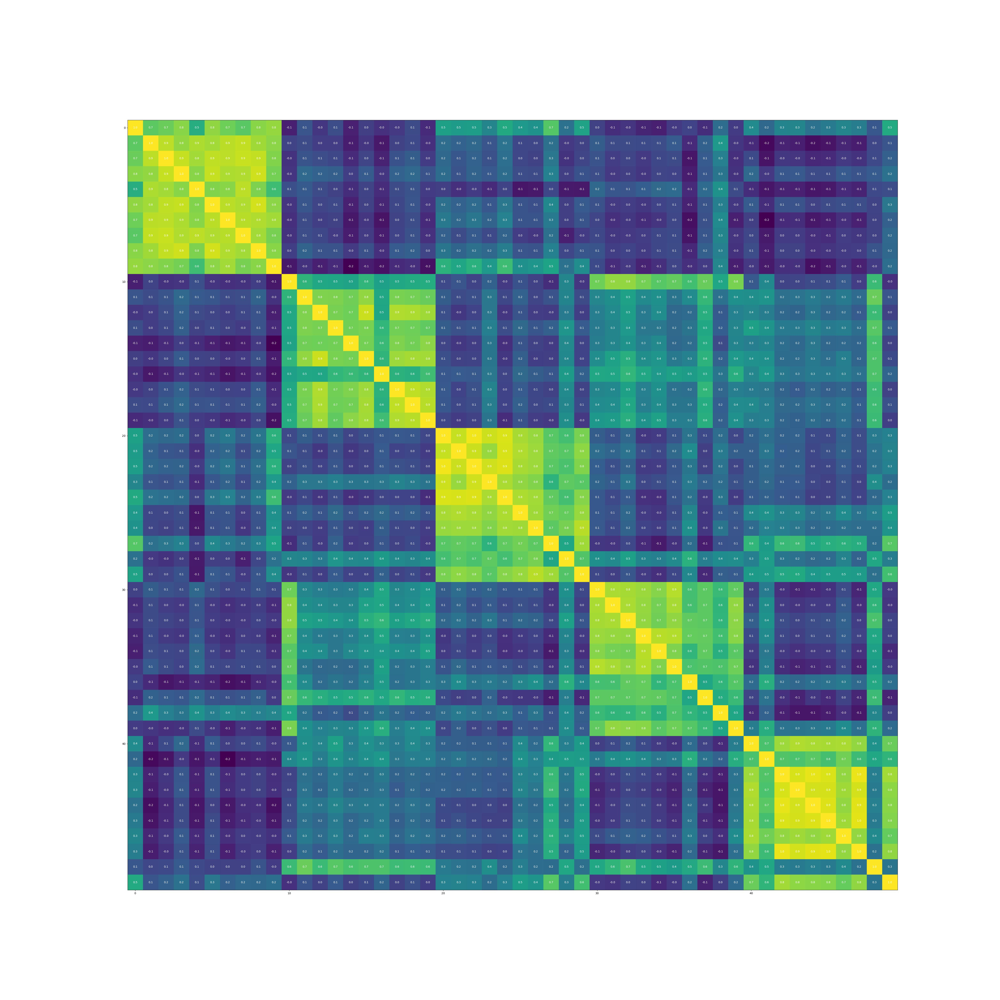
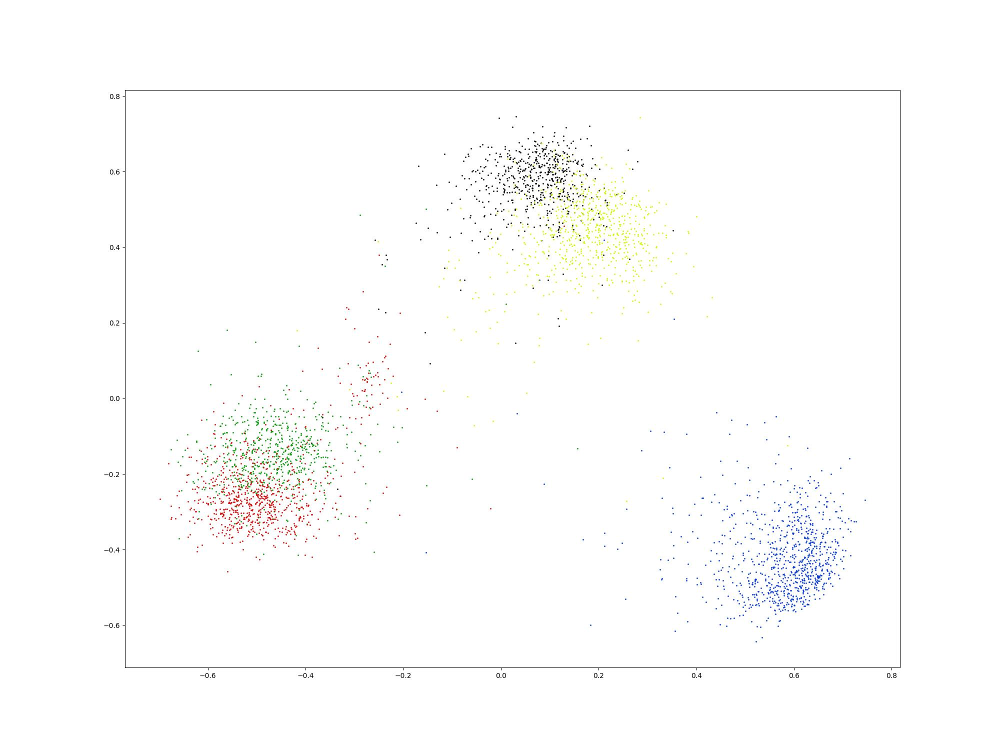

# pytorch-metric-learning-template
基于[pytorch-metric-learning](https://github.com/KevinMusgrave/pytorch-metric-learning)开源工具，实现了包括模型训练、模型验证、模型推理的相关代码。

## [pytorch-metric-learning度量学习工具官方文档翻译](./docs/tutorial.md)
</br>

## **模型训练**

* 使用cifar10数据集训练模型
```
python train_embedding_model_cifar10.py
```

* 使用cifar100数据集训练模型
```
python train_embedding_model_cifar100.py
```

* 使用flower花朵数据集训练模型，下载数据并解压后放在datasets目录下。flower花朵数据集见（链接：https://pan.baidu.com/s/1TfzLYZrkfwLy8wShy7nyMA  提取码：gxei）
    * 修改./config/embedding.yaml配置文件里面的train_dataset_dir指向数据集的位置
```
python train_embedding_model.py
```

* 使用pytorch-metric-learning提供的API训练模型
```
python trainer_model.py
```

* results目录下提供了几个训练好的模型文件
    * model_cifar10_SupervisedContrastiveLoss.pth 使用SupervisedContrastiveLoss在cifar10上训练的模型
    * model_cifar100_CircleLoss.pth 使用CircleLoss在cifar100上训练的模型
    * model_flower_photos_SupervisedContrastiveLoss.pth 使用SupervisedContrastiveLoss在flower花朵数据集上训练的模型

**备注**：上面这些模型使用的损失函数可以通过模型的名字得到，训练过程中做了embedding归一化，使用余弦相似度计算特征之间的距离
</br>

## **模型推理**
使用训练好的模型，以及pytorch-metric-learning工具提供的接口进行模型推理。
```
python model_inference.py
```
</br>

## **Embedding特征提取**
使用训练好的模型，将读入的数据转化为embedding特征。
```
python feature_extraction.py
```
</br>

## **Embedding特征可视化**
使用训练好的模型，将读入的数据转化为embedding特征，并对embedding降维后可视化。
```
python visualizer.py
```
</br>

## **自定义训练数据**
将数据按照类别ID存放在不同的目录中，具体格式可以参考flower花朵数据集那样。
</br>

## **模型效果展示**
* cifar10

<table>
    <tr>
        <td ><center>embedding特征之间的相似度可视化 </center></td>
        <td ><center>embedding特征降维之后可视化</center></td>
    </tr>
</table>

* cifar100

<table>
    <tr>
        <td ><center>embedding特征之间的相似度可视化 </center></td>
        <td ><center>embedding特征降维之后可视化</center></td>
    </tr>
</table>

* 花朵数据集（共5类）

<table>
    <tr>
        <td ><center>embedding特征之间的相似度可视化 </center></td>
        <td ><center>embedding特征降维之后可视化</center></td>
    </tr>
</table>
</br>

---

## **度量学习相关的损失函数介绍：**
* [度量学习DML之Contrastive Loss及其变种](https://blog.csdn.net/cxx654/article/details/122157804?spm=1001.2014.3001.5501)
* [度量学习DML之Triplet Loss](https://blog.csdn.net/cxx654/article/details/122158015?spm=1001.2014.3001.5501)
* [度量学习DML之Lifted Structure Loss](https://blog.csdn.net/cxx654/article/details/122158090?spm=1001.2014.3001.5501)
* [度量学习DML之Circle Loss](https://blog.csdn.net/cxx654/article/details/122158148?spm=1001.2014.3001.5501)
* [度量学习DML之Cross-Batch Memory](https://blog.csdn.net/cxx654/article/details/122158281?spm=1001.2014.3001.5501)
* [度量学习DML之MoCO](https://blog.csdn.net/cxx654/article/details/122158310?spm=1001.2014.3001.5501)
</br>

## **基于度量学习方法实现音乐特征匹配的系列文章**
* [从零搭建音乐识别系统（一）整体功能介绍](https://blog.csdn.net/cxx654/article/details/122387228?spm=1001.2014.3001.5502)
* [从零搭建音乐识别系统（二）音频特征提取](https://blog.csdn.net/cxx654/article/details/122387542?spm=1001.2014.3001.5502)
* [从零搭建音乐识别系统（三）音乐分类模型](https://blog.csdn.net/cxx654/article/details/122390476?spm=1001.2014.3001.5502)
* [从零搭建音乐识别系统（四）embedding特征提取模型](https://blog.csdn.net/cxx654/article/details/122391804?spm=1001.2014.3001.5502)
* [从零搭建音乐识别系统（五）embedding特征提取模型验证](https://blog.csdn.net/cxx654/article/details/122440716?spm=1001.2014.3001.5502)
