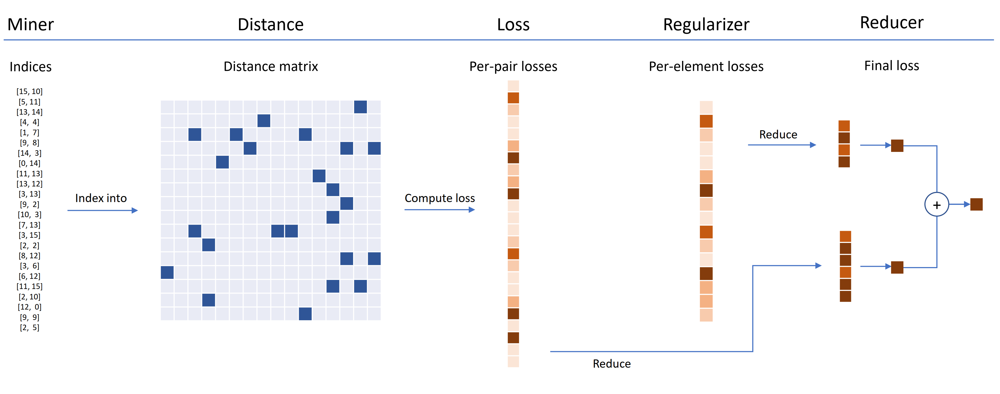
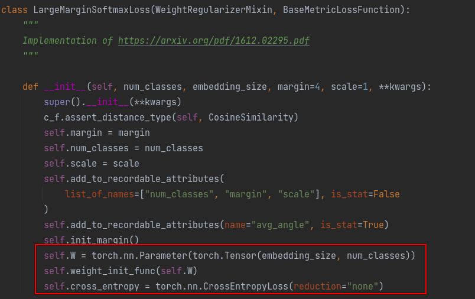

### 基于Pytorch实现的度量学习方法
 
 
 * 开源代码：[pytorch-metric-learning](https://github.com/KevinMusgrave/pytorch-metric-learning)
 * 官网文档：[PyTorch Metric Learning官方文档](https://kevinmusgrave.github.io/pytorch-metric-learning/)


#### **[1、整体总览](https://kevinmusgrave.github.io/pytorch-metric-learning/)**

[pytorch-metric-learning](https://github.com/KevinMusgrave/pytorch-metric-learning)包含9个模块，每个模块都可以在现有的代码库中独立使用，或者组合在一起作为一个完整的训练、测试工作流。


#### **1.1、自定义度量学习损失函数**

损失函数可以使用距离、规约方法和正则化方法来进行定制化。在下面的图表中，miner在批量中找到难训练的样本对的索引，这些索引被索引到距离矩阵。




### **[2、距离度量 Distances](https://kevinmusgrave.github.io/pytorch-metric-learning/distances/)**

Distance类用来计算成对的embedding之间的距离或者相似度。以三元组方法TripletMarginLoss为例，三元组的表示为<anchor, positive, negative>。其中anchor和positive构成正样本对，anchor和negative构成负样本对。

* 如果使用的是距离度量方法，就是拉近anchor和positive的距离，推远anchor和negative的距离，公式表示为 $ [d_{ap} - d_{an} + margin]_{+} $。

```
### TripletMarginLoss with squared L2 distance ###
from pytorch_metric_learning.distances import LpDistance
loss_func = TripletMarginLoss(margin=0.2, distance=LpDistance(power=2))

### TripletMarginLoss with unnormalized L1 distance ###
loss_func = TripletMarginLoss(margin=0.2, distance=LpDistance(normalize_embeddings=False, p=1))

### TripletMarginLoss with signal-to-noise ratio###
from pytorch_metric_learning.distances import SNRDistance
loss_func = TripletMarginLoss(margin=0.2, distance=SNRDistance())
```

* 如果使用的是相似度度量方法，就是增大anchor和positive的相似性，降低anchor和negative的相似性，公式表示为 $ [s_{an} - s_{ap} + margin]_{+} $。

```
### TripletMarginLoss with cosine similarity##
from pytorch_metric_learning.distances import CosineSimilarity
loss_func = TripletMarginLoss(margin=0.2, distance=CosineSimilarity())
```

**备注：** 所有的 losses、miners和regularizers都可以接受distance参数，但是有些方法有distance类型的限制，比如只能使用 CosineSimilarity 或者 DotProductSimilarity等，具体可以参考[losses 页面](https://kevinmusgrave.github.io/pytorch-metric-learning/losses/)

#### **2.1 基础距离计算类 BaseDistance**

所有的embedding距离/相似度计算子类都继承并扩展自BaseDistance类。

```
distances.BaseDistance(collect_stats = False,
                        normalize_embeddings=True, 
                        p=2, 
                        power=1, 
                        is_inverted=False)
```

* 参数解释：
    * collect_stats: 如果为 True，将收集可能在实验中对分析有用的各种统计数据。如果为False，这些计算将被跳过。想让True为默认值吗? 设置全局 COLLECT_STATS 标志。
    * normalize_embeddings: 如果为 True，在计算loss之前，embedding将会被归一化为模为 1。
    * p: 距离范数
    * power: 如果不是 1，embedding的每一个元素都会被以 mat = mat ** self.power 方式放大
    * is_inverted: 应该由子类设置。如果为False，则较小的值表示靠近的embedding（距离度量相关的子类默认设置为False）。如果为True，则较大的值表示彼此相似的embedding（相似性度量相关的子类默认设置为True）

继承BaseDistance类需要实现以下两个方法：
```
# Must return a matrix where mat[j,k] represents the distance/similarity between query_emb[j] and ref_emb[k]
def compute_mat(self, query_emb, ref_emb):
    raise NotImplementedError

# Must return a tensor where output[j] represents the distance/similarity between query_emb[j] and ref_emb[j]
def pairwise_distance(self, query_emb, ref_emb):
    raise NotImplementedError
```

#### **2.2 BatchedDistance**
没用过，也没搞懂。

#### **2.3 余弦相似度 CosineSimilarity**
余弦相似度，当embedding做了模为 1 的归一化之后，等于点积相似度 DotProductSimilarity。

#### **2.4 点积相似度 DotProductSimilarity**
返回两个embedding向量的点积结果，当embedding做了模为 1 的归一化之后，等于余弦相似度 CosineSimilarity。

#### **2.5 Lp范数 LpDistance**
Lp范数，默认是L2范数，也就是欧几里得距离。

#### **2.6 信噪比距离 SNRDistance**
</br>

### **[3. 损失函数 Losses](https://kevinmusgrave.github.io/pytorch-metric-learning/losses/)**
* 所有的损失函数都可以使用下面这种方式使用：
```
from pytorch_metric_learning import losses
loss_func = losses.SomeLoss()
loss = loss_func(embeddings, labels) # in your training for-loop
```

* 如果配合使用难样本挖掘方法，可以使用如下方式：
```
from pytorch_metric_learning import miners
miner_func = miners.SomeMiner()
loss_func = losses.SomeLoss()
miner_output = miner_func(embeddings, labels) # in your training for-loop
loss = loss_func(embeddings, labels, miner_output)
```

* 如果传入的是二元组或者三元组，有些损失函数可以不需要label标记：
```
loss = loss_func(embeddings, indices_tuple=pairs)
# it also works with ref_emb
loss = loss_func(embeddings, indices_tuple=pairs, ref_emb=ref_emb)
```

* 可以指定损失函数使用的规约方法reducer：
```
from pytorch_metric_learning import reducers
reducer = reducers.SomeReducer()
loss_func = losses.SomeLoss(reducer=reducer)
loss = loss_func(embeddings, labels) # in your training for-loop
```

* 计算损失的两个embedding可以来自于不同的来源(source)：
```
loss_func = losses.SomeLoss()
# anchors will come from embeddings, positives/negatives will come from ref_emb
loss = loss_func(embeddings, labels, ref_emb=ref_emb, ref_labels=ref_labels)
```

* 对于分类型的损失，可以通过 get_logits 函数获取概率值：
```
loss_func = losses.SomeClassificationLoss()
logits = loss_func.get_logits(embeddings)
```

目前支持以下损失函数，不同的损失函数具有不同的原理，适用于不同的场景，拥有不太一样的配置参数。有些损失函数对于distance有特殊的要求，默认的reducer可能有区别，详情参考官网。pytorch-metric-learning代码当前支持以下损失函数：
* AngularLoss
* ArcFaceLoss
* BaseMetricLossFunction
* CircleLoss
* ContrastiveLoss
* CosFaceLoss
* CrossBatchMemory
* DynamicSoftMarginLoss
* FastAPLoss
* GenericPairLoss
* GeneralizedLiftedStructureLoss
* InstanceLoss
* HistogramLoss
* IntraPairVarianceLoss
* LargeMarginSoftmaxLoss
* LiftedStructureLoss
* ManifoldLoss
* MarginLoss
* MultiSimilarityLoss
* MultipleLosses
* NCALoss
* NormalizedSoftmaxLoss
* NPairsLoss
* NTXentLoss
* P2SGradLoss
* PNPLoss
* ProxyAnchorLoss
* ProxyNCALoss
* RankedListLoss
* SelfSupervisedLoss
* SignalToNoiseRatioContrastiveLoss
* SoftTripleLoss
* SphereFaceLoss
* SubCenterArcFaceLoss
* SupConLoss
* TripletMarginLoss
* TupletMarginLoss
* WeightRegularizerMixin
* VICRegLoss

### **[4. 难样本挖掘 Miners](https://kevinmusgrave.github.io/pytorch-metric-learning/miners/)**

Miners的作用是在训练期间，在每个batch内挖掘更难被模型区分开的<anchor, positive, negative>样本对，这些样本对模型的性能影响最大，带来的损失更多。参照“1.1 自定义度量学习损失函数”，miner返回的是样本对的index，如[i, j]，根据index可以对应到batch内embeddings构成的distance矩阵上，得到对应样本对的距离值或者相似度值，也可以理解为损失值。

Miner函数接受一个大小为 n 的批量embedding，返回 k对或者k个三元组的索引，用于计算损失:
* Pair Miner输出大小为4的元组:(anchors, positives, anchors, negatives)。
* Triplet Miner输出大小为3的元组:(anchors, positives, negatives)。
* 如果没有使用Miner，损失函数将默认使用批量中所有可能的样本对或者三元组。

Miner需要与损失函数配合使用，不同的Miner可能适用的损失函数也不同，具体可以参考官网。Miner与损失函数结合使用的方式如下：
```
from pytorch_metric_learning import miners, losses
miner_func = miners.SomeMiner()
loss_func = losses.SomeLoss()
miner_output = miner_func(embeddings, labels)
losses = loss_func(embeddings, labels, miner_output)
```

pytorch-metric-learning代码当前支持以下Miner方法：
* AngularMiner
* BaseMiner
* BatchEasyHardMiner
* BatchHardMiner
* DistanceWeightedMiner
* EmbeddingsAlreadyPackagedAsTriplets
* HDCMiner
* MultiSimilarityMiner
* PairMarginMiner
* TripletMarginMiner
* UniformHistogramMiner

### **[5. 规约方法 Reducers](https://kevinmusgrave.github.io/pytorch-metric-learning/reducers/)**

Reducers是用来执行如何把batch里面样本产生的每个样本对的损失，汇总成一个总体损失，reducer接收的输入是loss_dict、embeddings、labels。其中loss_dict里面既包含训练损失，也包好正则化损失（对应下文的Regularizer）。方式如下：

```
self.reducer(loss_dict, embeddings, labels)
```

下面是Reducer起作用的地方：
```
这里是reducer适合这个库的过滤器和计算流的地方
```

reducer在代码中的使用方式如下：
```
from pytorch_metric_learning import losses, reducers
reducer = reducers.SomeReducer()
loss_func = losses.SomeLoss(reducer=reducer)
loss = loss_func(embeddings, labels) # in your training for-loop
```

在内部实现上，损失函数创建一个包含损失和其他信息的字典。reducer执行规约，并返回一个值，在这个值上可以调用backward()。大多数reducer都是这样编写的，它们可以被传递到任何损失函数中。

pytorch-metric-learning代码当前支持以下Reducer方法：

* AvgNonZeroReducer：非零值规约

```
[0, 2, 0, 3] -> (2+3) / 2 = 2.5
```
* **BaseReducer：** 基类，所有 reducers 都继承自这个类。
* **ClassWeightedReducer：** 带类别权重的规约，每个类别分别乘以对应的权重，然后在平均规约。
* **DivisorReducer：** 暂时没看懂，也没用过，哈哈哈
* **DoNothingReducer：** 不做规约，原样返回
* **MeanReducer：** 平均规约
* **MultipleReducers：** 包含了多个reducer，每个reducer应用于不同的子loss。对reducer的输出进行求和，得到最终loss

比如ContrastiveLoss有两个子loss: pos_loss用于正样本对，neg_loss用于负样本对。在下面的例子中，ThresholdReducer用于pos_loss, MeanReducer用于neg_loss。
```
from pytorch_metric_learning.losses import ContrastiveLoss
from pytorch_metric_learning.reducers import MultipleReducers, ThresholdReducer, MeanReducer
reducer_dict = {"pos_loss": ThresholdReducer(0.1), "neg_loss": MeanReducer()}
reducer = MultipleReducers(reducer_dict)
loss_func = ContrastiveLoss(reducer=reducer)
```

* **PerAnchorReducer：** 暂时没看懂，也没用过，哈哈哈
* **SumReducer：** 累加规约
* **ThresholdReducer：** 计算损失值在指定范围内的损失的平均值
```
ThresholdReducer(low=6):过滤 > 6 的loss求平均
[3, 7, 1, 13, 5] -> (7+13)/2 = 10

ThresholdReducer(high=6): 过滤 < 6 的loss求平均
[3, 7, 1, 13, 5] -> (1+3+5)/3 = 3

ThresholdReducer(low=6, high=12): 过滤 6 < losses < 12 的求平均
[3, 7, 1, 13, 5] -> (7)/1 = 7
```

### **[6. 正则化方法 Regularizers](https://kevinmusgrave.github.io/pytorch-metric-learning/regularizers/)**

正则化方法可以应用于损失函数里面的权重参数（通过weight_regularizer参数指定）和最后输出的embedding特征（通过embedding_regularizer参数指定），不需要标签或元组。

下面是一个将权重正则化传递给损失函数的例子。
```
from pytorch_metric_learning import losses, regularizers
R = regularizers.RegularFaceRegularizer()
loss = losses.ArcFaceLoss(margin=30, num_classes=100, embedding_size=128, weight_regularizer=R)
```

**备注：** 
* 每个损失函数都可以添加embedding_regularizer特征正则化
* SoftmaxLoss类的分类损失函数里面有需要训练的权重参数，可以添加权重正则化weight_regularizer，SoftmaxLoss类分类损失函数里面的参数权重示例如下：


#### **6.1 正则化基类 BaseRegularizer**

上面说了在损失函数里面的regularizer可以分为weight_regularizer和embedding_regularizer两种，weight_regularizer作用于损失函数里面的权重参数（如果有的话），embedding_regularizer作用于输出的embedding特征向量，并且每个损失函数都可以传入embedding_regularizer参数，但是不一定可以传入weight_regularizer参数。那么怎么确定一个损失函数能不能接受weight_regularizer和embedding_regularizer参数呢？

* 所有的embedding_regularizer都继承自BaseRegularizer基类，所以所有的Regularizer类都可以作为embedding_regularizer参数传给损失函数，适合作为embedding_regularizer的有：
    * **CenterInvariantRegularizer：** 鼓励非normalized的embedding或weight都具有相同的Lp范数
    * **LpRegularizer：** 鼓励embedding或weight具有较小的Lp范数
    * **ZeroMeanRegularizer：** 零均值正则化

* 如果一个损失函数继承了WeightRegularizerMixin类（比如基于SoftmaxLoss的损失函数），那么这个损失函数就可以接受weight_regularizer参数，适合作为weight_regularizer的有：
    * **CenterInvariantRegularizer：** 鼓励非normalized的embedding或weight都具有相同的Lp范数
    * **LpRegularizer：** 鼓励embedding或weight具有较小的Lp范数
    * **RegularFaceRegularizer：** 作为weight_regularizer正则化器来用，惩罚的是离得很近的类向量
    * **SparseCentersRegularizer：** 作为weight_regularizer正则化器来用，鼓励多个class中心“合并”，例如 group together

### **[7. 采样器 Sampler](https://kevinmusgrave.github.io/pytorch-metric-learning/samplers/)**

pytorch-metric-learning里面的Sampler只是torch.utils.data.Sampler类的扩展，需要通过指定sampler参数的方式，传递给PyTorch Dataloader。sampler的目的是确定如何构建batch。前面讲到的Miner样本挖掘方法就是在这里和Sampler采样器配合使用起作用的。

关于模型训练过程中，加载数据集的采样过程可以先看看[pytorch中Dataset、Dataloader、Sampler、collate_fn相互关系和使用说明](https://blog.csdn.net/cxx654/article/details/130999805?spm=1001.2014.3001.5501)这篇文章，详细介绍了数据采样的过程，以及其中每个步骤的作用。

在PyTorch深度学习框架中，Dataset、Dataloader、Sampler和collate_fn是数据加载和处理过程中非常重要的组成部分。这里大概描述一下数据采样过程中各个步骤的功能，以及它们之间的调用关系：
* **Dataset：** 定义了数据集的接口，用于读取和处理数据。通常情况下，Dataset是从文件或数据库中读取数据的集合，它可以对数据进行预处理、增强等操作，并返回一个可迭代的对象，用于后续的数据加载过程。
* **Dataloader：** 实现了数据集的批量加载功能。Dataloader可以根据Dataset返回的可迭代对象，将数据分成多个batch,并按照指定的采样方式(如随机采样、分层采样等)进行采样。同时，Dataloader还可以自动调整batch size、设置数据加载器状态等。
* **Sampler：** 定义了数据集中每个batch所包含的数据的位置索引。通常情况下，Sampler是在数据加载之前设置的一个对象，它可以根据用户指定的要求(如按照类别、标签等)对数据集进行采样，并返回每个batch所包含的数据的位置索引。
* **collate_fn：** 用于将一个batch中的数据进行拼接和整理。通常情况下，collate_fn是在Dataloader创建时设置的一个函数，它可以根据Dataset返回的可迭代对象和Sampler返回的位置索引，将不同长度的输入数据转换为统一的形状，并返回一个新的tensor作为batch的数据。

下面介绍一下pytorch-metric-learning里面支持的几种数据采样方法：
* **MPerClassSampler（batch中每个类别的样本数相同）**

在每次迭代中，这将返回每个类的m个样本，假设批大小是m的倍数。例如，如果您的数据加载器的批大小是100，并且m = 5，那么将返回20个类，每个类有5个样本。注意，如果没有指定batch_size，那么大多数batch中每个类将有m个样本，但不能保证每个batch都是这样。

* MPerClassSampler 参数解释:
    * labels: 样本对应的label编号列表，通过label里面的ID号进行样本个数选取
    * m: 在每个batch中，每个类别样本的数量，如果训练集中样本的数量少于m，则进行样本数据复制（重采样）
    * batch_size: batch大小，可选参数，batch_size的设置有一下几点约束：
        * batch_size必须要能被m整除
        * 样本的总数必须要大于一个batch_size
        * m乘以所有样本的类别数一定要大于 batch_size
    * length_before_new_iter: 个人理解这个表达的是，贼每个epoch中，在进行下一次迭代之前还有剩多少样本没有被处理过
* **HierarchicalSampler （没用过，详见官方文档）**
* **TuplesToWeightsSampler （没用过，详见官方文档）**
* **FixedSetOfTriplets （没用过，详见官方文档）**

### **[8. 训练 Trainers](https://kevinmusgrave.github.io/pytorch-metric-learning/trainers/)**

如果自己定义网络结构、损失函数、训练和验证过程，那么使用上面那些内容就可以了。但是有一些度量学习算法不仅仅是需要设置loss function或miner function。有些算法需要额外的网络、数据扩充、学习率衰减等。Trainers模块的目标是提供对这些类型的度量学习算法的使用。

通常，trainer可以通过如下方式使用：
```
from pytorch_metric_learning import trainers
t = trainers.SomeTrainingFunction(*args, **kwargs)
t.train(num_epochs=10)
```

#### **8.1 Trainer基类 BaseTrainer**

所有的Trainer类都继承自这个积累，并继承了它的__init__参数。

```
trainers.BaseTrainer(models,
                    optimizers,
                    batch_size,
                    loss_funcs,
                    dataset,
                    mining_funcs=None,
                    iterations_per_epoch=None,
                    data_device=None,
                    dtype=None,
                    loss_weights=None,
                    sampler=None,
                    collate_fn=None,
                    lr_schedulers=None,
                    gradient_clippers=None,
                    freeze_these=(),
                    freeze_trunk_batchnorm=False,
                    label_hierarchy_level=0,
                    dataloader_num_workers=2,
                    data_and_label_getter=None,
                    dataset_labels=None,
                    set_min_label_to_zero=False,
                    end_of_iteration_hook=None,
                    end_of_epoch_hook=None)
```

* 参数解释：
    * models: 以字典参数的形式指定网络模型，trunk_model指的是骨干网络，embedder_model指的是在骨干网络之上添加的用于生成embedding的子网络:
        * {"trunk": trunk_model, "embedder": embedder_model}
        * "embedder" key 是可选的
    * optimizers: 以字典参数的形式指定模型优化器，如果字典为空，就是没有optimizer，就不会做优化训练, 也可以只给trunk_model指定优化器，但是大部分情况下还是分别为trunk_model和embedder_model指定优化器：
        * {"trunk_optimizer": trunk_optimizer, "embedder_optimizer": embedder_optimizer}.
    * batch_size: 批量大小
    * loss_funcs: 以字典参数的形式指定:
        *{"metric_loss": loss_func}.
    * dataset: 训练数据集dataset，注意：训练方法不会执行验证操作，所以不要传入验证集或者测试集，验证或者测试过程单独执行
    * mining_funcs: 以字典参数的形式指定难样本挖掘函数:
        *{"subset_batch_miner": mining_func1, "tuple_miner": mining_func2}
    * data_device: 希望把数据放在哪个设备上训练，如果不指定，trainer 会把数据放到所有可用的GPUs上
    * dtype: 指定数据类型，例如torch.float16半精度
    * iterations_per_epoch: 每个epoch的迭代次数，可选参数，实在没搞懂具体的作用想干啥。
        * If you don't specify iterations_per_epoch:
            * 1 epoch = 1 pass through the dataloader iterator. If sampler=None, then 1 pass through the iterator is 1 pass through the dataset.
            * If you use a sampler, then 1 pass through the iterator is 1 pass through the iterable returned by the sampler.
        * For samplers like MPerClassSampler or some offline mining method, the iterable returned might be very long or very short etc, and might not be related to the length of the dataset. The length of the epoch might vary each time the sampler creates a new iterable. In these cases, it can be useful to specify iterations_per_epoch so that each "epoch" is just a fixed number of iterations. The definition of epoch matters because there's various things like LR schedulers and hooks that depend on an epoch ending.
    * loss_weights: 以字典参数的形式指定loss_function的权重
    * sampler: 指定加载训练数据的采样方式，比如MPerClassSampler，如果不指定则默认使用随机采样
    * collate_fn: collate function的作用是如何把采样到的数据整理成一个batch，详见[pytorch中Dataset、Dataloader、Sampler、collate_fn相互关系和使用说明](https://blog.csdn.net/cxx654/article/details/130999805?spm=1001.2014.3001.5501)这篇文章
    * lr_schedulers: 以字典参数的形式指定学习率调整策略，可以分别指定骨干网络trunck_model，特征子网络embedder_model和损失函数loss_function（前提是损失函数包含可训练的参数）的学习率调整策略，字典key的格式为 model_step_type，其中model来自于models或者loss_function参数里面的key，step_type是下面的某一种：
        * scheduler_by_iteration 每个迭代调整一次学习率
        * scheduler_by_epoch 每个epoch调整一次学习率
        * scheduler_by_plateau 比如当准确率不在升高时调整学习率</br></br>具体示例如下：

        * trunk_scheduler_by_iteration
        * metric_loss_scheduler_by_epoch
        * embedder_scheduler_by_plateau
    * gradient_clippers: 以字典参数的形式指定梯度裁剪策略，在调用backward计算梯度，调用optimizer进行参数更新之前进行梯度裁剪
    * freeze_these: 指定冻结哪些参数，这些参数的requires_grad属性被置为False，可选
    * freeze_trunk_batchnorm: 冻结骨干网络Batch_Norm的可学习参数，Batch_Norm里面有四个参数，其中均值和方差通过滑动平均得到，不用训练，另外还有 $\gamma$ 和 $\beta$ 是可训练参数
    * label_hierarchy_level: 默认为0，用于一个样本具有多个标签的场景
    * dataloader_num_workers: 加载训练数据的并行度
    * data_and_label_getter: 根据dataset里面__getitem__函数返回的内容转换成(data, labels)格式，没看懂想干嘛，可能是自定义的dataset的__getitem__函数返回的内容包含其他信息（比如data的均值、方差等），在模型训练时需要过滤掉
    * dataset_labels: 数据样本对应的标签，如果数据是单标签的，那么就是一维的，如果数据是多标签，那么就是二维的，行数等于样本数，列数等于标签的类别数量
    * set_min_label_to_zero: 和dataset_labels参数配合使用，我理解主要思想就是把类别标签（比如 cat、dog）等重新编号程0,1,2这种样式，一般可以在加载dataset的时候就处理好了
    * end_of_iteration_hook: 这是一个可选的hook 钩子函数，这个钩子函数的输入是一个trainer对象，主要用于获取模型训练过程中的中间结果。This is an optional function that has one input argument (the trainer object), and performs some action (e.g. logging data) at the end of every iteration. Here are some things you might want to log:
        * trainer.losses: this dictionary contains all loss values at the current iteration.
        * trainer.loss_funcs and trainer.mining_funcs: these dictionaries contain the loss and mining functions.
            * Some loss and mining functions have attributes called _record_these or _record_these_stats. These are lists of names of other attributes that might be useful to log. (The list of attributes might change depending on the value of COLLECT_STATS.) For example, the _record_these_stats list for BaseMiner is ["num_pos_pairs", "num_neg_pairs", "num_triplets"], so at each iteration you could log the value of trainer.mining_funcs["tuple_miner"].num_pos_pairs. To accomplish this programmatically, you can use record-keeper. Or you can do it yourself: first check if the object has _record_these or _record_these_stats, and use the python function getattr to retrieve the specified attributes.
            * If you want ready-to-use hooks, take a look at the logging_presets module.
    * end_of_epoch_hook: This is an optional function that operates like end_of_iteration_hook, except this occurs at the end of every epoch, so this might be a suitable place to run validation and save models.
        * To end training early, your hook should return the boolean value False. Note, it must specifically return False, not None, 0, [] etc.
        * For this hook, you might want to access the following dictionaries: trainer.models, trainer.optimizers, trainer.lr_schedulers, trainer.loss_funcs, and trainer.mining_funcs.
        * If you want ready-to-use hooks, take a look at the logging_presets module.

#### **8.2 MetricLossOnly**

MetricLossOnly这个Trainer只计算输出embedding特征的度量学习损失。

* 参数解释：
    * models: {"trunk": trunk_model， "embedder": embedder_model}，其中trunk参数是必须的，embedder参数可以没有
    * loss_funcs: {"metric_loss": loss_func}

#### **8.3 TrainWithClassifier**

TrainWithClassifier这个Trainer适用于trunk -> embedder -> classifier这样的网络结构。对embedder网络的输出应用度量损失，对classifier网络的输出应用分类损失。

* 参数解释：
    * models: {"trunk": trunk_model, "embedder": embedder_model, "classifier": classifier_model}，其中embedder是可选的
    * loss_funcs: {"metric_loss": loss_func1, "classifier_loss": loss_func2}

#### **8.4 CascadedEmbeddings**

这玩意迷之复杂，我理解大概意思就是用多个embedder头来输出特征，多个头单独计算loss，然后最终的输出就是把多个头的embedding拼接起来，没用过，不知道咋样。

#### **8.5 DeepAdversarialMetricLearning**

这玩意比上一个级联的网络更玄幻，都用上生成对抗了，理解大概意思就是通过生成假样本来提高模型的特征表达能力和鲁棒性。没用过，不知道咋样。

#### **8.6 TwoStreamMetricLoss**

说的是用两路计算，没看懂怎么个两路法。

### **[9. 测试 Testers](https://kevinmusgrave.github.io/pytorch-metric-learning/testers/)**

在解释模型测试之前先解释几个名词：
* query：查询样本，就是说我输入一个样本，用这个样本在一个样本集里面根据embedding的距离或者相似度进行查询匹配，这个样本就叫做query
* reference：参考样本（被查询），上面说到的样本集里面的所有样本都叫做参考样本，就是通过计算query和reference之间的距离或者相似度来衡量模型的性能指标

Testers使用模型和数据集，计算基于最近邻的准确性度量。请注意，Testers需要faiss包。

Testers的代码示例：
```
from pytorch_metric_learning import testers
t = testers.SomeTestingFunction(*args, **kwargs)
dataset_dict = {"train": train_dataset, "val": val_dataset}
all_accuracies = tester.test(dataset_dict, epoch, model)

# Or if your model is composed of a trunk + embedder
all_accuracies = tester.test(dataset_dict, epoch, trunk, embedder)
```

#### **9.1 Testing splits**

默认情况下，传入tester.test的dataset_dict里面的每一个数据集都会单独的计算测试指标。就是说训练集上的指标是在训练集的样本之间计算的，验证集上的指标实在验证集的样本之间计算的。由tester.test()接受的可选参数splits_to_eval允许更大的灵活性。splits_to_eval是一个(query_split， [list_of_reference_splits])元组的列表。其中query_split用来在测试阶段作为查询样本，list_of_reference_splits用来测试阶段作为参考样本（被查询）。那么通过指定splits_to_eval就可以实现多个样本集之间的交叉验证。

假如dataset_dict里面包含两个数据集，对应dataset_a和train两个key，那么通过设置splits_to_eval参数就可以构造下面几种验证方式：
* 情形一：默认splits_to_eval = None的情况等价与下面这样，这种情况下对于dataset_a数据集的测试，query和reference都来自于dataset_a，对于train数据集的测试，query和reference都来自于train:
```
splits_to_eval = [('dataset_a', ['dataset_a']), ('train', ['train'])]
```
* 情形二：将dataset_a数据集作为query, train数据集作为reference:
```
splits_to_eval = [('dataset_a', ['train'])]
```
* 情形三：将dataset_a数据集作为query, dataset_a + train as数据集作为reference:
```
splits_to_eval = [('dataset_a', ['dataset_a', 'train'])]
```

**注意：**
* 问题：使用splits_to_eval来做这种所谓的交叉验证有什么作用呢？
* 回答一：从数据分布一致性的角度回答，假如train是模型的训练集，dataset_a是模型的验证集，假如train来自于互联网图片，dataset_a来自于手机拍摄的图片，那么train和dataset_a的数据集分布是不一致的，此时通过这种交叉验证的方式就可以检验模型在这种场景的鲁棒性
* 回答二：从数据组合、数据规模的角度回答，针对特征匹配的算法，我们通常关注两个指标，一个是召回率，一个是误匹配率，召回率就是看能不能通过特征把正确的结果匹配上，这个没啥说的。误匹配率就是说本来query和reference八竿子打不着，但是通过特征相似度确匹配上了。假设一种情况，当reference的规模是10000的时候，误匹配率是1%，那么随着reference规模的扩大，模型的误匹配率可能会急剧升高，导致我随意输入一个query，在reference里面都会给出一个错误的匹配结果，这样的模型可能在召回率上很好，但是错误率也很高，其实是没办法使用的。


#### **9.2 BaseTester**

所有的testers类都继承自这个积累，并继承了它的__init__参数。

```
testers.BaseTester(normalize_embeddings=True,
                    use_trunk_output=False,
                    batch_size=32,
                    dataloader_num_workers=2,
                    pca=None,
                    data_device=None,
                    dtype=None,
                    data_and_label_getter=None,
                    label_hierarchy_level=0,
                    end_of_testing_hook=None,
                    dataset_labels=None,
                    set_min_label_to_zero=False,
                    accuracy_calculator=None,
                    visualizer=None,
                    visualizer_hook=None,)
```

* 参数解释：
    * normalize_embeddings: 如果设置为True，在计算embedding特征的最近邻结果之前会进行模为1的归一化操作
    * use_trunk_output: 如果为True，就使用trunk_model的输出来计算最近邻结果，忽略embedder模型的输出结果
    * batch_size: 从数据集中提取embedding时采用的批量大小
    * dataloader_num_workers: 加载数据集采用的并行度
    * pca: 是否使用PCA对embedding特征进行降维
    * data_device: 希望把数据放在哪个设备上训练，如果不指定，会把数据放到所有可用的GPUs上
    * dtype: 指定数据类型，例如torch.float16半精度
    * data_and_label_getter: 根据dataset里面__getitem__函数返回的内容转换成(data, labels)格式，没看懂想干嘛，可能是自定义的dataset的__getitem__函数返回的内容包含其他信息（比如data的均值、方差等），在模型训练时需要过滤掉
    * label_hierarchy_level: 默认为0，用于一个样本具有多个标签的场景
    * end_of_testing_hook: 钩子函数
        * You'll probably want to access the accuracy metrics, which are stored in tester.all_accuracies. This is a nested dictionary with the following format: tester.all_accuracies[split_name][metric_name] = metric_value
        * If you want ready-to-use hooks, take a look at the logging_presets module.
    * dataset_labels: 数据样本对应的标签，如果数据是单标签的，那么就是一维的，如果数据是多标签，那么就是二维的，行数等于样本数，列数等于标签的类别数量
    * set_min_label_to_zero: 和dataset_labels参数配合使用，我理解主要思想就是把类别标签（比如 cat、dog）等重新编号程0,1,2这种样式，一般可以在加载dataset的时候就处理好了
    * accuracy_calculator: AccuracyCalculator对象，使用他来计算模型的准确率
    * visualizer: 降维之后可视化
    * visualizer_hook: 可选参数。该函数将被传递以下参数。你可以在这个函数中做任何你想做的事情，但它存在的原因是允许你保存嵌入的绘图等
        * embeddings: 需要被降维的embeddings特征
        * label: 每个embedding对应的标签label
        * split_name: The name of the split (train, val, etc.)
        * keyname: The name of the dictionary key where the embeddings and labels are stored.
        * epoch: The epoch for which the embeddings are being computed.

BaseTesters中的函数：
* tester.test：在dataset_dict上调用这个函数测试模型。它返回一个accuracy字典。
```
all_accuracies = tester.test(
    dataset_dict, # dictionary mapping strings to datasets
    epoch, # used for logging
    trunk_model, # your model
    embedder_model=None, # by default this will be a no-op
    splits_to_eval=None,
    collate_fn=None # custom collate_fn for the dataloader
)
```

* tester.get_all_embeddings：使用数据集和模型，返回所有embedding和label
```
embeddings, labels = tester.get_all_embeddings(
    dataset, # Any pytorch dataset
    trunk_model, # your model
    embedder_model=None, # by default this will be a no-op
    collate_fn=None, # custom collate_fn for the dataloader
    eval=True, # set models to eval mode
    return_as_numpy=False
 )
```

#### **9.3 GlobalEmbeddingSpaceTester**

通过在全部的embedding嵌入空间中查询所有的点(而不是子集)来计算最近邻。这可能是您正在寻找的Testers。就是说把每一个query都和embedding嵌入空间中的所有样本进行比较，更能真实的反应模型的性能。这个方法有下面两个问题：

1. 当验证集数量太大时，如果使用faiss-gpu进行计算，会出现显存溢出的问题
2. 当验证集数量太大时，如果使用faiss-cpu进行计算，计算速度贼慢
3. 我一般采用faiss-gpu进行计算，但是当验证集数量太大时，进行均衡采样，在子集上计算

#### **9.4 WithSameParentLabelTester**

这一般用于层级式的标签数据。比如 {cat, dog, car, truck}对应到{animal, vehicle}

#### **9.5 GlobalTwoStreamEmbeddingSpaceTester**

这个对应于 TwoStreamMetricLoss 这个Trainer，dataset的__getitem__返回的必须是(anchor, positive, label)格式的数据

### **[10. 计算模型准确率 Accuracy Calculation](https://kevinmusgrave.github.io/pytorch-metric-learning/accuracy_calculation/)**

AccuracyCalculator类计算给定query和reference embedding特征的多个准确性度量指标。可以很容易地扩展以创建自定义精度度量方法。

```
from pytorch_metric_learning.utils.accuracy_calculator import AccuracyCalculator
AccuracyCalculator(include=(),
                    exclude=(),
                    avg_of_avgs=False,
                    return_per_class=False,
                    k=None,
                    label_comparison_fn=None,
                    device=None,
                    knn_func=None,
                    kmeans_func=None)
```

* 参数解释：
    * include: 可选参数。由string组成的list或者tuple，string的内容是想要计算的指标的名字，如果为空，所有的默认指标都会被计算，默认的度量指标有以下几种：
        * AMI
        * NMI
        * mean_average_precision
        * mean_average_precision_at_r
        * mean_reciprocal_rank
        * precision_at_1
        * r_precision
    * exclude: 可选参数。由string组成的list或者tuple，string的内容是不想计算的指标的名字
    * avg_of_avgs: 如果True，先计算每个类别的平均准确率，在求平均得到最终的平均值，这在当数据集的类别分布不均衡的时候有用，如果False，直接计算全局平均值
    * return_per_class: 如果True，返回每个类别的平均准确率
    * k: 基于距离度量或者相似度度量方法，通过k个最近邻的样本计算模型的性能指标，k的数值可以是下面几种：
        * None. 这意味着k的大小等于数据集的大小，也就是全局检索匹配
        * 任意一个大于0的数值
        * max_bin_count通过这个方法计算max(bincount(reference_labels)) - self_count。bincount函数是统计列表中元素出现的个数，当query和reference来自于同一个数据集时（表示数据分布一致），self_count == 1
    * label_comparison_fn: 比较两个实用torch array表示的label数组，并返回一个布尔数组。默认采用torch.eq进行计算。如果自定义比较函数，必须在exclude中排除基于聚类的度量指标 ("NMI" and "AMI")，见下面的代码示例
    * device: 设备
    * knn_func: 可以自定义K近邻的计算方法，这个方法要接收4个输入参数(query, k, reference, ref_includes_query)，并返回distances和indices。默认采用pytorch_metric_learning.utils.inference.FaissKNN.
    * kmeans_func: 可以自定义聚类方法，这个方法要接收2个参数(x, nmb_clusters)，并返回聚类中心。默认使用pytorch_metric_learning.utils.inference.FaissKMeans

```
from pytorch_metric_learning.distances import SNRDistance
from pytorch_metric_learning.utils.inference import CustomKNN

def example_label_comparison_fn(x, y):
    return (x[:, 0] == y[:, 0]) & (x[:, 1] != y[:, 1])

knn_func = CustomKNN(SNRDistance())
AccuracyCalculator(exclude=("NMI", "AMI"), 
                    label_comparison_fn=example_label_comparison_fn,
                    knn_func=knn_func)
```

### **10.1 Getting accuracy**

调用Accuracy Calculation的get_accuracy方法获取字典形式的准确率指标。

```
def get_accuracy(self, 
    query,
    query_labels,       
    reference=None,
    reference_labels=None, 
    ref_includes_query=False, 
    include=(),
    exclude=()
):
# returns a dictionary mapping from metric names to accuracy values
# The default metrics are:
# "NMI" (Normalized Mutual Information)
# "AMI" (Adjusted Mutual Information)
# "precision_at_1"
# "r_precision"
# "mean_average_precision_at_r"
```

* 参数解释：
    * query: 是一个2D的torch或numpy数组，大小是(Nq, D)，其中Nq表示样本数量，D表示特征的维度。对于每个query样本，检索最近邻并计算准确率
    * query_labels: 是一个1D的torch或numpy数组，大小是(Nq)。每个元素是一个表示样本label的整数
    * reference: 是一个2D的torch或numpy数组，大小是(Nr, D)，其中Nr表示被检索的样本数量，D表示特征的维度。query和reference进行匹配，所以是reference被检索
    * reference_labels: 是一个1D的torch或numpy数组，大小是(Nr)。每个元素是一个表示样本label的整数
    * ref_includes_query: 如果query是reference的子集或query就是reference，则设置为True。否则设置为False。
    * include: 可选参数。由string组成的list或者tuple，string的内容是想要计算的指标的名字，如果为空，所有的默认指标都会被计算
    * exclude: 可选参数。由string组成的list或者tuple，string的内容是不想计算的指标的名字

### **10.2 Lone query labels**

如果一些query的label标签没有出现在reference的label集合中，那么这些标签不可能具有非零k-nn精度。这些标签得到的精度是0，但是并不表明embedding空间的质量有任何问题。因此，这些单独的查询标签需要被排除在基于k-nn的精度计算之外。

### **10.3 CPU/GPU usage**

* 如果安装的是faiss-cpu，那就确认会使用CPU进行计算
* 如果安装的是faiss-gpu，当k <= 1024并且CUDA < 9.5，以及k <= 2048并且CUDA >= 9.5时会使用GPU计算计算，否则使用CPU进行计算

如果你的数据集很大，并且当k的值为None时，可能会发现k-nn搜索非常慢。这是因为默认行为是将k设置为len(reference_embeddings)。为了避免这种情况，可以将k设置为一个数字，例如k = 1000，或者尝试k = "max_bin_count"。

### **10.4 Adding custom accuracy metrics**

也可以自定义准确率的计算方法。

### **[11. Inference Models](https://kevinmusgrave.github.io/pytorch-metric-learning/inference_models/)**

utils.inference中包含便于在批处理中或从一组pair中查找匹配对的类。代码示例如下：

```
from pytorch_metric_learning.utils.inference import InferenceModel
InferenceModel(trunk,
                embedder=None,
                match_finder=None,
                normalize_embeddings=True,
                knn_func=None,
                data_device=None,
                dtype=None)
```

* 参数解释：
    * trunk: 训练好的骨干模型
    * embedder: 可选参数，如果在训练时区分了trunk和embedder，这里就需要指定embedder模型
    * match_finder: embedding特征的匹配方法，默认是MatchFinder(distance=CosineSimilarity(), threshold=0.9)
    * normalize_embeddings: embedding特征归一化
    * knn_func: k近邻算法，默认使用 FaissKNN()
    * data_device: 使用的计算设备
    * dtype: 数据类型

```
# initialize with a model
im = InferenceModel(model)

# pass in a dataset to serve as the search space for k-nn
im.train_knn(dataset)

# add another dataset to the index
im.add_to_knn(dataset2)

# get the 10 nearest neighbors of a query
distances, indices = im.get_nearest_neighbors(query, k=10)

# determine if inputs are close to each other
is_match = im.is_match(x, y)

# determine "is_match" pairwise for all elements in a batch
match_matrix = im.get_matches(x)

# save and load the knn function (which is a faiss index by default)
im.save_knn_func("filename.index")
im.load_knn_func("filename.index")
```

#### **11.1 特征向量匹配查找 MatchFinder**

```
from pytorch_metric_learning.utils.inference import MatchFinder
MatchFinder(distance=None, threshold=None)
```

* 参数解释：
    * distance: 距离度量方法，比如CosineSimilarity()
    * threshold: 距离匹配的阈值

#### **11.2 特征向量K近邻匹配 FaissKNN**

```
from pytorch_metric_learning.utils.inference import FaissKNN
FaissKNN(reset_before=True,
            reset_after=True, 
            index_init_fn=None, 
            gpus=None)
```

```
# use faiss.IndexFlatIP on 3 gpus
knn_func = FaissKNN(index_init_fn=faiss.IndexFlatIP, gpus=[0,1,2])

# query = query embeddings 
# k = the k in k-nearest-neighbors
# reference = the embeddings to search
# last argument is whether or not query and reference share datapoints
distances, indices = knn_func(query, k, references, False)
```

#### **11.3 特征向量K-means聚类 FaissKMeans**

```
from pytorch_metric_learning.utils.inference import FaissKMeans
FaissKMeans(**kwargs)
```

```
kmeans_func = FaissKMeans(niter=100, verbose=True, gpu=True)

# cluster into 10 groups
cluster_assignments = kmeans_func(embeddings, 10)
```

#### **11.4 自定义特征向量K近邻匹配 CustomKNN**

可以自定义KNN分类方法，指定使用的距离度量方法。

```
from pytorch_metric_learning.utils.inference import CustomKNN
CustomKNN(distance, batch_size=None)
```

```
from pytorch_metric_learning.distances import SNRDistance
from pytorch_metric_learning.utils.inference import CustomKNN

knn_func = CustomKNN(SNRDistance())
distances, indices = knn_func(query, k, references, False)
```

在前面讲的AccuracyCalculator部分，默认使用FaissKNN计算模型的性能指标，FaissKNN并没有提供修改距离度量方法的参数，这就可能导致损失函数的距离度量方法与FaissKNN的度量方法不一致，这是最好使用CustomKNN自定义KNN方法，同时使用与损失函数相同的，或者与任务特性相符合的距离度量方法。详情参考[这里](https://github.com/KevinMusgrave/pytorch-metric-learning/issues/368)。代码示例如下：

```
from pytorch_metric_learning.testers import GlobalEmbeddingSpaceTester
from pytorch_metric_learning.distances import SNRDistance
from pytorch_metric_learning.utils.inference import CustomKNN

knn_func = CustomKNN(SNRDistance())
ac = AccuracyCalculator(knn_func=knn_func)
tester = testers.GlobalEmbeddingSpaceTester(accuracy_calculator=ac)
```

### **[12. Logging Presets](https://kevinmusgrave.github.io/pytorch-metric-learning/logging_presets/)**

logging_presets模块包含用于记录数据、模型验证和保存模型，以及在训练期间提前停止的hook钩子。它需要依赖record-keeper和tensorboard两个包，这两个包可以通过pip安装:
```
pip install record-keeper tensorboard
```

下面是把logging_presets集成到trainer和tester一起使用的代码示例：
```
import pytorch_metric_learning.utils.logging_presets as LP
log_folder, tensorboard_folder = "example_logs", "example_tensorboard"
record_keeper, _, _ = LP.get_record_keeper(log_folder, tensorboard_folder)
hooks = LP.get_hook_container(record_keeper)
dataset_dict = {"val": val_dataset}
model_folder = "example_saved_models"

# Create the tester
tester = testers.GlobalEmbeddingSpaceTester(end_of_testing_hook=hooks.end_of_testing_hook)
end_of_epoch_hook = hooks.end_of_epoch_hook(tester, dataset_dict, model_folder)
trainer = trainers.MetricLossOnly(models,
                                optimizers,
                                batch_size,
                                loss_funcs,
                                mining_funcs,
                                train_dataset,
                                sampler=sampler,
                                end_of_iteration_hook=hooks.end_of_iteration_hook,
                                end_of_epoch_hook=end_of_epoch_hook)

trainer.train(num_epochs=num_epochs)
```

### **[13. 分布式 Distributed](https://kevinmusgrave.github.io/pytorch-metric-learning/distributed/)**

当使用PyTorch的 DistributedDataParallel进行分布式训练时，用这些封装来封装 tuple loss或者 miner，来实现分布式训练

#### **13.1 DistributedLossWrapper**

```
utils.distributed.DistributedLossWrapper(loss, efficient=False)
```

* 参数解释：
    * loss: 损失函数
    * efficient:
        * True: 每个进程使用自己独立的embeddings来作为anchors，并收集embeddings的positives/negatives，同时梯度也会与非分布式的状态不一致，因为没有在多卡之间做数据的同步操作，但是好处就是可以节省显存并且加速训练过程，因为跨GPU的通信少了
        * False: 每个进程都会对embedding进行gather操作，把多张卡的embedding都汇总到一起，然后进行计算。这种情况下梯度是严格一致的。但是会,带来额外的不必要的计算 (i.e. doing computations where both anchors and positives/negatives have no gradient).

代码示例：
```
from pytorch_metric_learning import losses
from pytorch_metric_learning.utils import distributed as pml_dist

loss_func = losses.ContrastiveLoss()
loss_func = pml_dist.DistributedLossWrapper(loss_func)

# in each process during training
loss = loss_func(embeddings, labels)
```

#### **13.2 DistributedLossWrapper**

```
utils.distributed.DistributedMinerWrapper(miner, efficient=False)
```

* 参数解释：
    * miner: miner方法
    * efficient: 如果对损失函数包装的时候efficient=True，那么miner的efficient也必须是True

代码示例：
```
from pytorch_metric_learning import miners
from pytorch_metric_learning.utils import distributed as pml_dist

miner = miners.MultiSimilarityMiner()
miner = pml_dist.DistributedMinerWrapper(miner)

# in each process
tuples = miner(embeddings, labels)
# pass into a DistributedLossWrapper
loss = loss_func(embeddings, labels, indices_tuple)
```